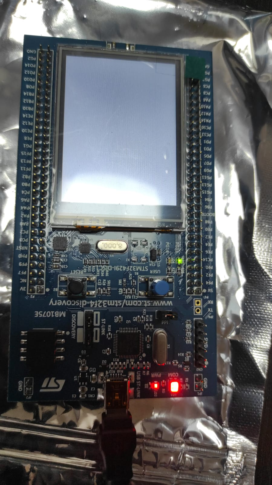

# Embedded System Bare-Metal Programming for STM32F4xx_MCU
Bare-metal programming for the SMT32 Microcontrollers. No libraries used, only manipulation of the registries.

## Summary
The content within this repository is my own work produced as a result of completing the course  "Embedded Systems Bare-Metal Programming Ground Up™ (STM32)" , authored by Israel Gbati.
* https://www.udemy.com/course/embedded-systems-bare-metal-programming/

The source code is tested on STM32 Nucleo 144 family boards.
* https://www.st.com/en/evaluation-tools/nucleo-f429zi.html
* https://www.st.com/en/evaluation-tools/32f429idiscovery.html

### STM32 Nucleo F429ZI

### STM32F429I_DISCOVERY1 board 

Bare-metal drivers included:

* DMA,
* ADC,
* UART,
* TIMER,
* GPIO,
* SPI,
* I2C,
* SysTick
* Interrupts 

### About me
* George Calin
* george.calin [at] gmail.com
* LinkedIn: https://www.linkedin.com/in/cgeorge1978/
